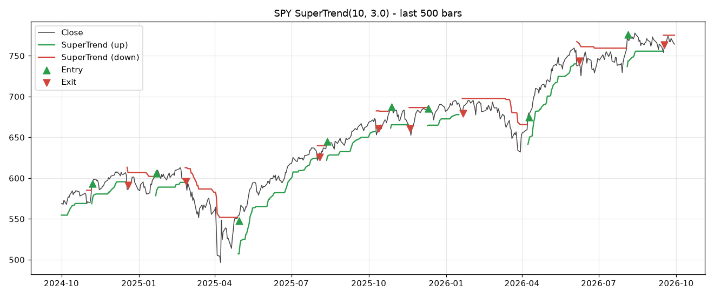
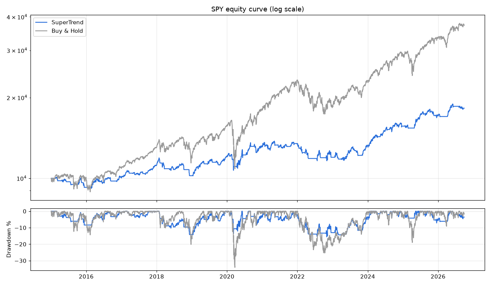

# TradingView Pine Script → Python Backtest (SuperTrend)

Ports a TradingView strategy ([`strategy.pine`](strategy.pine)) to Python and backtests it on SPY daily data (2015-01 to 2026-09).

The results are checked by running the strategy through **two independent engines**: [backtrader](https://www.backtrader.com/) and a small backtester written from scratch in pandas. Both must produce the same trades and the same equity curve, to within floating-point error.

## Results

SuperTrend(10, 3), long only. $10,000 starting capital, 95% of equity per trade, 0.05% commission per side.

|               | SuperTrend | Buy & Hold |
|:--------------|-----------:|-----------:|
| Total return  |      82.6% |     272.0% |
| CAGR          |      5.27% |     11.84% |
| Max drawdown  | **-15.6%** |     -34.1% |
| Sharpe (rf=0) |       0.59 |       0.73 |
| Trades        |         51 |          - |
| Win rate      |      47.1% |          - |
| Profit factor |       1.96 |          - |

**Takeaway:** on SPY, the strategy cuts the maximum drawdown by more than half (it sat out most of the 2020 crash and the 2022 bear market). It also gives up most of the upside, so it underperforms buy & hold on both return and Sharpe ratio. Trend filters like this tend to suit more volatile, trending assets better than a steadily rising index.




## How the port is verified

| Check | Where |
|---|---|
| `ta.rma`, `ta.atr` and `ta.supertrend` follow Pine's definitions, including the SMA seed and the first-bar true range | [`supertrend.py`](supertrend.py), `test_rma_matches_wilder_definition` |
| No look-ahead bias: changing future prices never changes past indicator values | `test_supertrend_has_no_lookahead` |
| Orders fill at the **next bar's open** (TradingView's default) | `test_orders_fill_at_next_open` |
| backtrader and the pandas engine agree trade-for-trade on random data | `test_backtrader_and_pandas_engines_agree` |
| Both engines agree on the real SPY run (checked on every run) | `run.py` → `check_engines_agree` |

## Run it

```bash
python -m venv .venv
.venv\Scripts\activate        # macOS/Linux: source .venv/bin/activate
pip install -r requirements.txt
pytest -q                     # offline tests, synthetic data
python run.py                 # downloads SPY, runs both engines, writes output/
```

Outputs in `output/`: `report.md`, `trades.csv`, `signals.png`, `equity.png`, and `supertrend_values.csv`, which has the SuperTrend line and direction for every bar.

## Comparing with TradingView

1. Add `strategy.pine` to a SPY daily chart. Leave "Adjust data for dividends" off; Yahoo's `Close` is also split-adjusted only.
2. Use the Data Window to compare the SuperTrend values on any date with `supertrend_values.csv`.
3. Small differences in trade P&L can come from how each platform rounds share quantities, and from minor differences between data vendors.

## Project layout

```
strategy.pine          original TradingView strategy
data.py                Yahoo Finance download, cached as Parquet
supertrend.py          Pine-compatible RMA / ATR / SuperTrend
engine_pandas.py       from-scratch bar-by-bar backtester
engine_backtrader.py   same strategy in backtrader
metrics.py             CAGR, drawdown, Sharpe, win rate, profit factor
run.py                 runs everything and writes the report
tests/                 pytest suite
```
